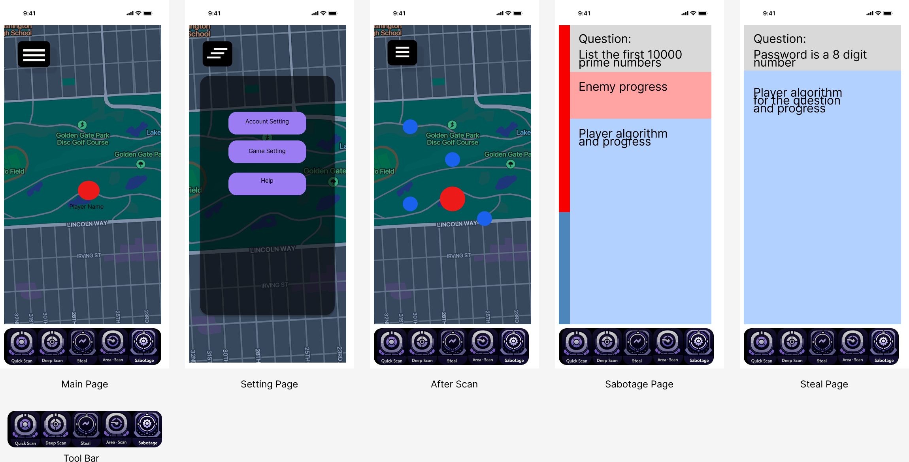

# CSS545 Checkpoint 1

### platform:

IOS

### framework/programming language:

Swift

### Whether you want to explore cross-platform development

yes, we want to do cross-platform development

### Include a brief explanation for your selections

We want to store user data in the cloud. Also, if our team wants to do a
game project, we want our battle process and data exchange in the
cloud.

# Checkpoint 1 - Project Proposal, initial design, and Challenges and Solutions

## Project Name: Hacking Game

Group members: Qingran Shao, Wentao Gao

Version Alpha

## Summary of project:

In our view, games are an exceedingly effective means of communication and entertainment. Chess and Go, through continuous competition, not only provides the joy of dopamine for the brain but also trains one's thinking. Video games break down the barriers of time and space that traditional games face. For example, Minecraft not only entertains but also encourages players to actively and proactively learn about logic circuits. The aim of the hacking game is to fill spare time while also fostering more interactions and connections among people, encouraging exchanges not just of languages but also of game activities. Additionally, in terms of market value, I hope to move away from traditional game monetization models that rely on loot boxes, purchasing in-game currency, and reducing game difficulty with cash. My revenue goal is to sell actual tools that enhance the playability of the game, such as cloud servers. In hacker duels, using tools, macros, or even AI pre-set in the servers to enhance gameplay can significantly elevate the commercial purpose and playability of the game。

## Project Analysis

### Value Proposition

Factually, there's a trend of development in games that resonate with my thoughts, with Pokémon Go being a prime example. Despite this, games like Pokémon Go and Ingress Prime often revolve around a singular, repetitive action pattern. This can lead to a decline in engagement among most players in the long run, especially when fresh content is lacking and there's no room for player creativity like in Minecraft.

### Primary Purpose

Our aspiration is to foster a game that not only motivates outdoor activities through mobile gaming but also possesses an extensive potential for gameplay evolution, including aspects like PvP and PvE confrontations. I believe that the incorporation of gamified hacking activities might be the ultimate resolution to enhance the gaming experience.

### Target Audience

Our targeted audience is people who wish to communicate with others on topics such as computer tech and network skills. We also encourage teenagers to play with code, mathematics, and hardware when they experience our game.

### Success Criteria

An event, a party that brings everyone together to play. To assess the success of this game, one should look beyond just profit and user numbers. We envision our game as a tool that enables quick socializing for players, even in unfamiliar public spaces. Here's an instance: in the current Chinese context of team-building work events and business negotiations, Honor of Kings – a mobile game akin to Dota – has taken over as the primary social instrument, surpassing traditional dinner gatherings or golf. In our view, if our game becomes one of the activity options at parties, then that will mark our success.

Success Criteria:
The true measure of our app's success isn't solely financial gain or the sheer number of users. It's about user satisfaction, market share, and the public good. We will evaluate our game's triumph through its ability to facilitate quick social interactions in any setting, its adoption as a preferred social tool in various gatherings, and whether it becomes a go-to choice for entertainment at parties. These indicators will tell us that our game has achieved its goal, beyond just the bottom line.

### Monetization Model

In-app purchases and Freemium.

### Competitor Analysis

The pros and cons list for Pokémon GO:

#### Advantages:

- Real-time GPS tracking that motivates people to step outside and socialize.
- The Pokémon IP has tremendous value and appeal.
- The gameplay is intuitive and easy to grasp.
- The game features high-quality models and visuals.

#### Disadvantages:

- The PvP (Player vs. Player) combat can be rather monotonous.
- The game tends to have a short lifespan for user engagement.
- The content of the game can become dull over time.

## Initial Design

This project introduces a multiplayer mobile game that simulates real-time hacking. In this game, participants assume the role of hackers aiming to compromise the virtual assets of their opponents. Upon entering specific real-world locations such as campuses, parks, or malls, players automatically become part of an ongoing game with others who have the app active.

Initially, players must conduct a scan to identify potential targets. This process comes in three modes: quick scan, deep scan, and area scan. The quick scan briefly surveys all players in the vicinity, providing a count and vague locations of some. The deep scan, although three times slower, offers the exact locations of all players in the area. The area scan, on the other hand, meticulously examines a smaller, designated zone for detailed information.

Once a target is chosen, the player can opt to either steal values from or sabotage the device of the selected opponent. To steal, the player must crack the target's protective lock within five seconds. Success means acquiring the target's virtual assets, while failure alerts the victim and initiates a hacking duel. Opting for sabotage directly leads to a hacking confrontation, with the aim of overwhelming the victim's defenses to plunder their assets.

### UI/UX Design

### Technical Architecture

## Challenges and Open Questions

### Form factor

We will use iPhone 13 as the standard Test platform.

### Restoration Of Data on Reinstall

User Account (Username and Password) will be stored online, e.g. AWS.
User Generate-Content (Skill, Purchases, and Level) will be stored online.

### GPS sensors

Unity may not invoke iOS Devices' GPS sensors, so that is the reason we may use Xcode and Unity together.

### Interaction With AWS

We have little experience with AWS, so we may meet many issues with we deploy a response server on AWS.
